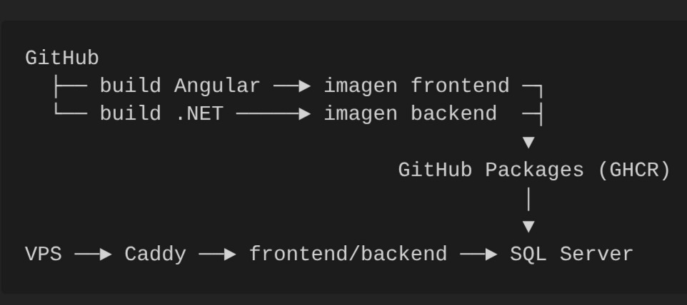

* Recurso	Valor
* Dominio	FeliGallery.kity.dev
* Base de datos	FeliGalleryDB
* Contenedor backend	feligallery-backend
* Contenedor frontend	feligallery-frontend
* Usuario SQL de runtime	feligallery_app
* Usuario SQL migrador	feligallery_migrator
* Imagen backend	ghcr.io/feli-pollo/gallery-backend
* Imagen frontend	ghcr.io/feli-pollo/gallery-frontend
* Directorio en el VPS	/opt/apps/FeliGallery

